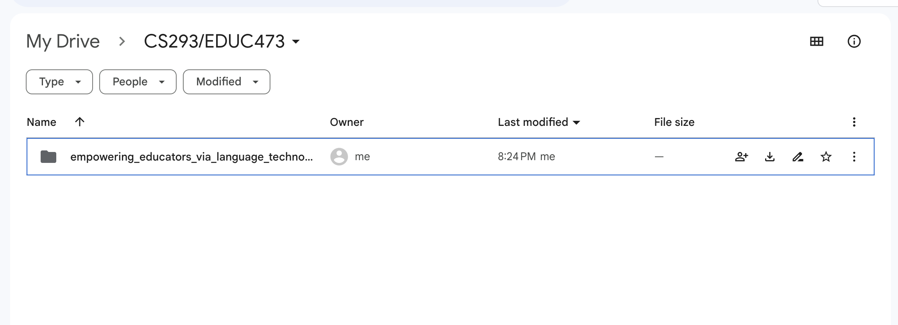
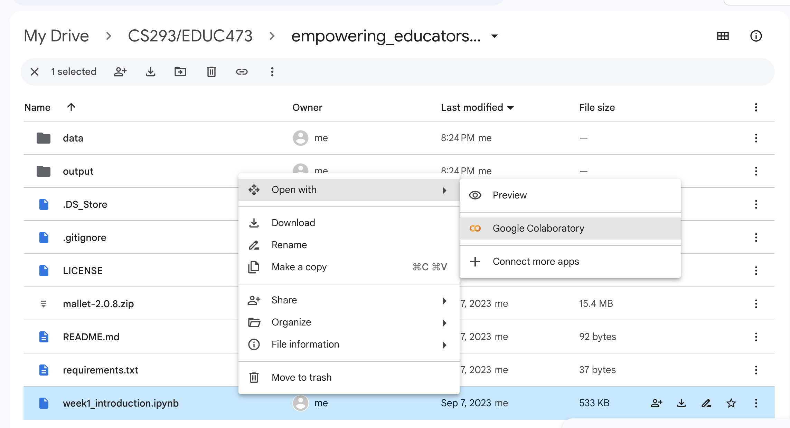

# CS 293 / EDUC 473: Empowering Educators via Language Technology

[Course Website](https://web.stanford.edu/class/cs293/)

This repository contain the course assignments. 
The assignments are designed to be hosted on **Google Colab** because Colab minimizes the amount of setup needed to run the code and provides free acces to computing resources, including GPUs, which will be important for HW2.
You may of course do the assignments without Colab---however, you will be responsible for adapting the notebooks and code accordingly.

## Instructions

These instructions are for setting up the assignments in Google Colab.

### For HW1 ...

First, clone the repository: 

```
git clone https://github.com/rosewang2008/cs293_empowering_educators_via_language_technology.git
```

Then copy this folder into your Google Drive. It should look like:




Then you can open `week1_introduction.ipynb` in Google Colab from your Drive folder.




### For all following assignments... 

For all following assignments, you can navigate to where you cloned the repository and run 

```
git pull
```

The new assignments should then be pulled. You can then copy and paste the new assignments into the Google Drive folder with the other assignments.

